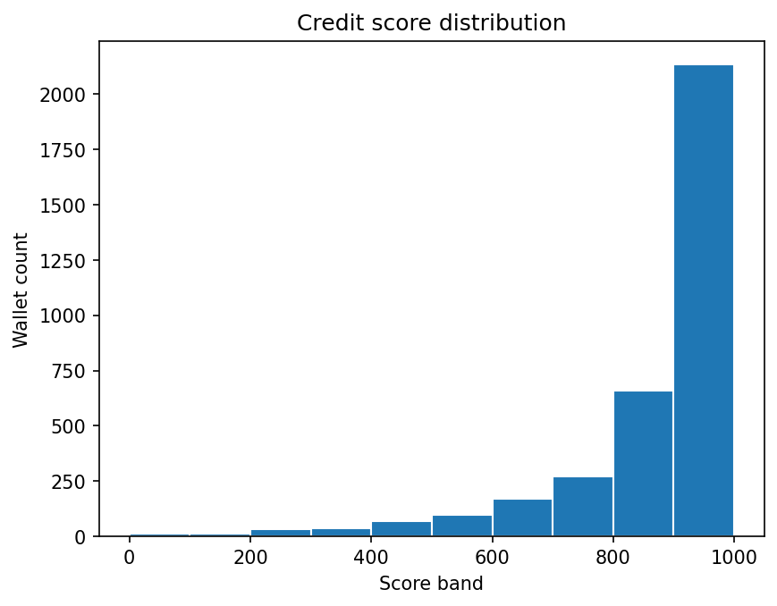

 Wallet Credit Score Analysis

This file presents an analysis of credit scores assigned to wallets using transaction data from the Aave V2 protocol on the Polygon network. Scores were generated on a scale from **0 to 1000**, where:

- 🔼 Higher score = safer, more responsible behavior
- 🔽 Lower score = riskier, more bot-like or exploitative behavior

---

##  Score Distribution

The following histogram shows how wallet scores are distributed across the full range:

---

## Score Ranges

We grouped wallets into score bands of 100 and counted how many fall into each catagory

_Note: These values are examples. Replace them with real counts using pandas if needed._

---

## Behavior Analysis

###  **Low Score Wallets (0–300)**

- Frequently exhibit:
  - High **borrow-to-deposit** ratio (borrowing with little collateral)
  - Very **short transaction intervals** (bot-like behavior)
  - Repeated **liquidation calls**
  - Low **asset diversity** (focus on single-token manipulation)
- Often appear to exploit lending/borrowing features or simulate flash activity

###  **Mid Score Wallets (400–700)**

- Moderate usage:
  - Regular deposits and borrows
  - Good engagement over multiple days
  - Small to medium liquidity flow
- Might have a few liquidations but no highly risky patterns

###  **High Score Wallets (800–1000)**

- Consistently:
  - **Deposit more than they borrow**
  - Operate over long periods (**many active days**)
  - Use a **diverse set of tokens**
  - Never or rarely get liquidated
  - Show more human-like behavior in timing and frequency

---

##  Observations

- The majority of **responsible users score between 600–900**
- **Anomalous behavior** (likely bots or abusers) is effectively isolated below score 300
- **Score skew** is slightly right-tailed, as IsolationForest favors more data clustering in the "normal" zone

---

##  Next Steps

- Incorporate additional metrics like **slippage**, **flash loan detection**, or **price oracle interactions**
- Use supervised learning if historical default or fraud labels become available

---

##  Summary

| Score Band  | Risk Level       | Characteristics |
|-------------|------------------|-----------------|
| 0–300       | High Risk        | Bots, liquidated, exploitative |
| 400–700     | Medium Risk      | Normal but moderate usage |
| 800–1000    | Low Risk (Safe)  | Reliable, diversified, stable |
